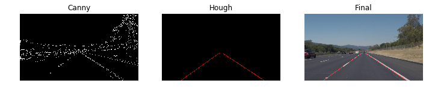
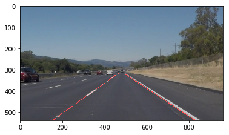

# LaneDetection

Lane Detection project can be decomposed into three sections.

1. Grayscale, Blur, Canny Edge
2. Utility functions: Masking, Drawing lines, Applying lines to image
3. Hough Transform

### 1. Grayscale, Blur, Canny Edge
Use of color to detect lanes faces a multitude of problems, as lanes are not always the same color and different lighting conditions (day, night, etc) can cause misdetections. To overcome, I have firstly grayscaled and blurred the image slightly to reduce color sensitiveness. 

Then, I applied canny edge techniques to measure change of gradients and identify edges of objects. 

### 2. Utility functions: Masking, Drawing lines, Applying lines to image
Since location of lanes are quite consistent, I have set to only look for edges at bottom half of images. 
Then I have written functions that draws lines on original images.

### 3. Hough Transform
Now that we have detected edges of objects, we would filter for the kind of edges that we are looking for. As we are interested in left and right lanes that are relatively straight, tilted in 45 degree angle, we would set appropriate thresholds.

The sequence of processed images would result in:

### Outcome
Final Outcome of this project comes out to be:

